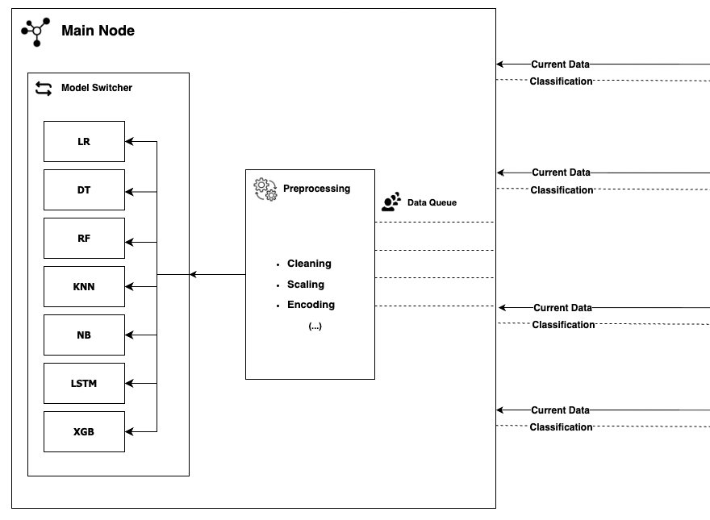

# IoT Energy Consumption — Analytical Pipeline

This repository contains all source code used for the work of "IoT Energy Consumption — Analytical Pipeline".

For more information contact: edllyn@ime.usp.br



## Table of Contents

1. [Introduction](#1-introduction)  
   1.1 [Directory Organization](#11-directory-organization)  
   1.2 [Dragon_Pi Dataset](#12-dragon_pi-dataset)  
   1.3 [Python Environment](#13-python-environment)  
2. [Exploratory Data Analysis (EDA)](#2-exploratory-data-analysis-eda)  
3. [Running the Pipeline](#3-running-the-pipeline)   
6. [Citation](#6-citation)

## 1. Getting Started

Follow these steps to replicate our data organization and Python environment:

### Directory Organization

#### Analytical Pipeline Structure

The following directories will be created:
```
.
├── analytical_pipeline/
└── dragon_pi/
    ├── dragon/
    │   ├── dragon_bruteforce_large/
    │   ├── dragon_portscan_large/
    │   ├── dragon_ctfs_large/
    │   └── dragon_dos_large/
    │       └── dragon_synflood.csv
    └── pi/
        ├── pi_bruteforce_large/
        ├── pi_portscan_large/
        ├── pi_ctfs_large/
        └── pi_dos_large/
            └── pi_synflood.csv
├── models/
    └── attack_model.pkl
├── results/
│   ├── metrics/
│   └── plots/
        └── split.py
        └── SMOTE.py
    └── training_results_model_attack.csv
├── src/
    └── model_training.py
    └── pipeline_data.py
    └── sample_distribution.py
├── training/
│   └── df_windows.csv
```

### Configuring the Dragon_Pi dataset

The `Dragon_Pi` dataset are publicly available at the following location: https://zenodo.org/records/10784947

### Replicating Python Environment (with Conda and GPU Support)

#### Create and Activate Conda Environment

```shell
conda create -n pipeline python=3.10
source /opt/conda/etc/profile.d/conda.sh
conda activate pipeline
```

#### Install Pip dependencies

For the `analytical pipeline` environment, use the following command:
```shell
pip install -r requirements.txt
```

## 2. Exploratory Data Analysis (EDA)

We conducted an Exploratory Data Analysis (EDA) of the Dragon_pi dataset to further understand its structure. All insights are available at the following notebook `notebooks/exploratory_data_analysis_eda.ipynb`.

## 3. Running the Pipeline

To execute the full **analytical pipeline** for energy-consumption–based intrusion detection, simply run:

> In our experiments, we used a system with an **Intel Core i7-8665U** for local runs and a **GPU-enabled node** (Ubuntu 24.04 with Conda, CUDA, and TensorFlow) on the USP cluster for deep learning tests.  
> At least **16 GB RAM** is recommended for CPU-based runs, or **8 GB GPU memory** for LSTM training.

```bash
python pipeline_data.py 
```

```bash
python -m model_training.py \
    --attack ALL \
    --model ALL \
```

## 4. Citation

To be published.
